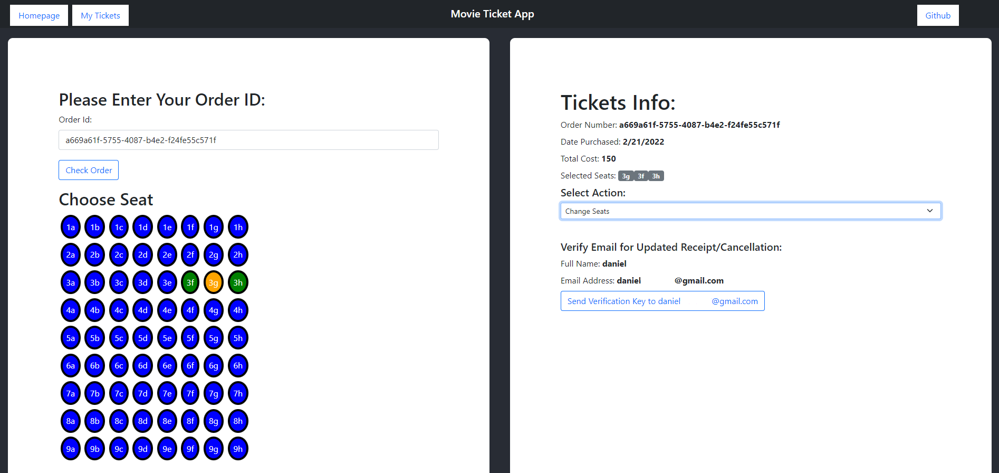

# Welcome To My Movie Ticket Api

## Lunch the app:

```
    1. docker-compose up --build
    2. docker exec -it seed /bin/bash
    3. python main.py
    4. service cron start
```

## View the app on `http://localhost:3000/`:

##### Home Page:


##### Single Movie Page:


##### Personal Ticket Hub:


