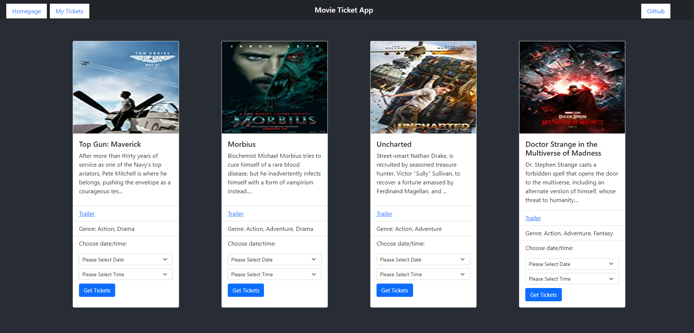
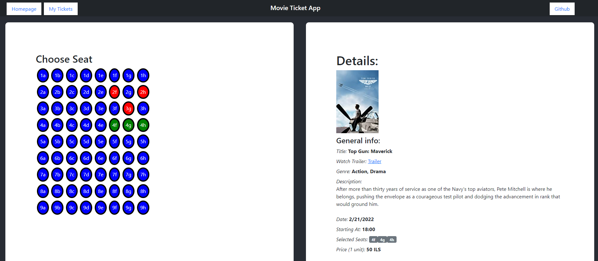
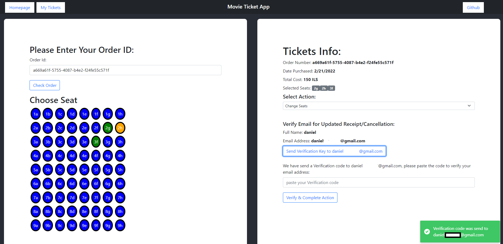

# Welcome To My Movie Ticket App

## Lunch the app:

open up the docker-compose.yml file and replace the next fields with your actual data (in order to have mails sent from your mail account make sure to edit your email's access configurations):

```
    MONGO_URI: *your-mongo-uri*
    MY_EMAIL_ADDR: *your-email-address*
    MY_EMAIL_PASS: *your-email's-password*
    SECRET: *64-bit-hash-key*
```

open up a terminal:

```
    docker-compose up --build
```

open up another terminal:

```
    1. docker exec -it seed /bin/bash
    2. service cron start
    3. python main.py
    4. exit
```

## General Description:

```
    1. select a movie, time & date and click "Get Tickets"
    2. select seats as you wish, fill in the email verification form and then click "Send verification key to `my email`"
    3. enter your email account, copy your verification code and paste it in the targeted filled.
    4. Enter your payments info (demo, make sure to enter fake details but valid) and click "Complete Purchase"
    5. Your Order details will be sent be mail.
    6. in order to change seats or cancel your ticket feel free to enter "My Tickets" area with your personal order id.
    7. The movies database will update everyday with new dates and movies
    8. enjoy and feel free to note out every issue you have seen!
```

## View the app on `http://localhost:3000/`:

#### Home Page:



#### Single Movie Page:



#### Personal Ticket Hub:



## Api Documentation:

### Movie endpoints

```
BASE URL http://localhost:4000/api
```

```
GET /movies/get-movies
GET /movies/details/{movie_id}
POST /movies/add-movie
DELETE /movies/delete-movie/{movie_id}

```

### Ticket endpoints

```
GET /tickets/view-tickets
GET /tickets/view-ticket-details/{secret_id}
POST /api/tickets/get-verification
POST /api/tickets/verify
POST /api/tickets/purchase-ticket
PUT /api/tickets/change-seat
DELETE /api/tickets/cancel-ticket

```

### General usage Movie endpoints

```
POST http://localhost:4000/api/movies/add-movie
Content-Type: application/json

{
    "movie_title": string,
    "img": string,
    "trailer": string,
    "genres": [
        type: string
    ],
    "description": string,
    "price": number,
    "movie_date": string,
    "time_start": string
}
```

```
GET http://localhost:4000/api/movies/get-movies
```

```
GET http://localhost:4000/api/movies/details/{movie_id}
```

```
DELETE http://localhost:4000/api/movies/delete-movie/{movie_id}
```

### General usage Movie endpoints

```
POST http://localhost:4000/api/tickets/get-verification
Content-Type: application/json

{
    "full_name":string,
    "email":string,
    "age": number
}
```

```

POST http://localhost:4000/api/tickets/verify
Authorization: Bearer {string}
Content-Type: application/json

{
    "full_name":string,
    "email":string
}
```

```
POST http://localhost:4000/api/tickets/purchase-ticket
Authorization: Bearer {string}
Content-Type: application/json

{
    "full_name": string,
    "movie_id": string,
    "email": string,
    "movie_title": string,
    "seats": [
        type: string
    ],
    "price": number,
    "movie_date": string,
    "time_start": string,
    "card_number": string,
    "card_expiration_date": string,
    "national_id": string,
    "ccv": string
}
```

```
GET http://localhost:4000/api/tickets/view-tickets
```

```
GET http://localhost:4000/api/tickets/view-ticket-details/{secret_id}
```

```
PUT http://localhost:4000/api/tickets/change-seat
Authorization: Bearer {string}
Content-Type: application/json

{
    "movieId": string,
    "full_name": string,
    "email": string,
    "prevSeats": [
        type: string
    ],
    "seats": [
        type: string
    ],
    "orderId": string
}
```

```
DELETE http://localhost:4000/api/tickets/cancel-ticket
Authorization: Bearer {string}
Content-Type: application/json

{
    "movieId": string,
    "full_name": string,
    "email": string,
    "seats":[
        type: string
    ],
    "orderId": string
}
```
